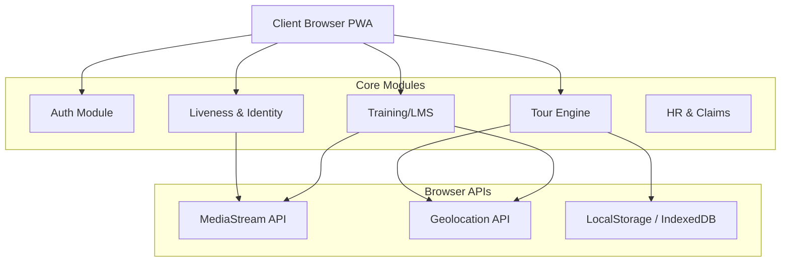

# Nexby Field-Force Pro - Technical Solution Architecture

## 1. Executive Summary
Nexby Field-Force Pro is a client-side, Progressive Web Application (PWA) designed to manage distributed field workforces. It facilitates real-time attendance verification, complex tour/trip workflows, training compliance (LMS), and expense management. The application is built with a "Privacy-First, Offline-Ready" mindset, utilizing browser-native APIs for hardware access (Camera, GPS) and local persistence for the MVP phase.

## 2. Technology Stack

### Frontend Core
- **Framework**: React 18 (Functional Components, Hooks)
- **Language**: TypeScript 5.3 (Strict Type Safety)
- **Build Tool**: Vite 5 (Fast HMR and bundling)
- **Routing**: React Router DOM v6 (Client-side routing)

### UI & UX
- **Styling**: Tailwind CSS (Utility-first, mobile-first responsive design)
- **Iconography**: Lucide React (Lightweight SVG icons)
- **Animations**: CSS Transitions + Tailwind `animate-in` utilities
- **Components**: Modular, atomic design pattern (`components/FormElements.tsx`, etc.)

### Hardware Integration
- **Camera**: `navigator.mediaDevices.getUserMedia` for video streams and image capture.
- **Geolocation**: `navigator.geolocation` for coordinates and geofencing.

### State Management (MVP)
- **Persistence**: `localStorage` wrapper pattern.
- **Local State**: React `useState` and `useReducer` for complex modal flows.
- **Global State**: Managed via shared hooks and storage event listeners (e.g., in `Navbar.tsx` for notifications).

## 3. High-Level Architecture Diagram



## 4. Key Module Implementation Details

### 4.1. Attendance & Liveness Verification
This module replaces traditional usernames/passwords for daily activity.
- **Liveness Detection**: A heuristic-based simulation (for MVP) that prompts users to perform random actions (Blink, Turn Head). In production, this connects to a TensorFlow.js model or server-side biometric API.
- **Anti-Spoofing**: Requires a live camera feed; prevents file uploads for verification steps.
- **Logic**:
  - `AttendanceModal.tsx`: Orchestrates the flow.
  - `Permission` -> `Liveness Challenge` -> `Capture` -> `Geo-Tagging`.

### 4.2. Tour (Trip) Engine
The core business logic handling the lifecycle of a field visit.
- **State Machine**:
  1.  **Upcoming**: Planned trip.
  2.  **Outward**: Travel to site (Time/Distance tracking starts).
  3.  **On-Site**: Work execution (Geo-fenced arrival check).
  4.  **Return**: Travel back to base.
  5.  **Completed**: Work done, ready for claims.
  6.  **Claimed**: Expenses submitted.
- **Dynamic Inputs**: 
  - If `Weather == Rain` OR `Mode == Public Transport`, the app adapts requirements (e.g., asking for specific photo evidence).

### 4.3. Training (LMS) with Geofencing
Ensures users are physically present at training venues.
- **Distance Calculation**: Uses Haversine formula to compare `UserCoords` vs `VenueCoords`.
- **Threshold**: Defaults to 200 meters.
- **Evidence**: Requires "Start Session" selfie (Attendance) and "End Session" board photo (Completion).

### 4.4. Expense & Claims
- **Auto-Calculation**: 
  - `Travel Allowance = Distance (km) * Vehicle Rate (₹/km)`.
  - Rates are configurable constants (`RATES` in `ExpenseClaimModal.tsx`).
- **Receipt Parsing**: Camera integration to capture bills.

## 5. Data Models (Schema)

The application uses a strict TypeScript schema (`types.ts`) ensuring consistency.

### Tour Object
```typescript
interface Tour {
  id: string;
  projectId: string;
  status: 'Upcoming' | 'In Progress' | 'Completed' | 'Claimed';
  tourPhase?: 'OUTWARD' | 'ON_SITE' | 'RETURN';
  
  // Timestamps
  actualStartDate?: string;
  siteArrivalTime?: string;
  returnStartTime?: string;
  actualEndDate?: string;
  
  // Evidence
  startSelfieUrl?: string;
  siteArrivalSelfieUrl?: string;
  returnStartSelfieUrl?: string;
  endSelfieUrl?: string;
  
  // Logistics
  transportMode?: 'Bike' | 'Car' | 'Bus';
  distanceCovered?: number;
}
```

## 6. Security & Privacy

1.  **Hardware Access**: 
    - The app explicitly requests permissions only when needed.
    - Video streams are stopped immediately after capture to protect privacy and battery life.
2.  **Data Isolation**:
    - In the current MVP, data resides in the user's browser.
    - No PII is transmitted to external servers (mock environment).
3.  **Geofencing**:
    - Location data is processed client-side to verify presence without constant tracking.

## 7. Future Backend Integration Roadmap

To move to production, the app requires REST/GraphQL endpoints.

| Feature | HTTP Method | Endpoint | Payload |
|:---|:---|:---|:---|
| **Login** | POST | `/api/auth/login` | `{ email, password }` |
| **Sync Tours** | GET | `/api/tours` | - |
| **Start Trip** | POST | `/api/tours/{id}/start` | `{ lat, lng, selfie_blob }` |
| **Update Phase** | PUT | `/api/tours/{id}/phase` | `{ phase: 'ON_SITE', lat, lng }` |
| **Submit Claim** | POST | `/api/claims` | `{ tour_id, items: [] }` |

## 8. Scalability Considerations

- **Code Splitting**: Routes are lazy-loaded (via React Router) to ensure fast initial load times on low-bandwidth mobile networks.
- **Asset Optimization**: Images captured are compressed (canvas `toDataURL` quality parameter) before storage to prevent local storage quota overflow.
- **Offline Support**: The architecture supports adding a Service Worker for full offline capabilities (Workbox), allowing data queuing when network is unavailable.
